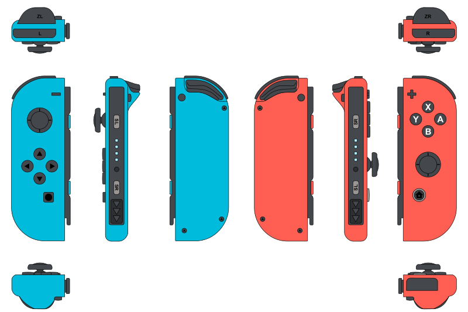

# Nintendo Joy-Con

## Details
The Joy-Con implementation is based on the [JoyconLib](https://github.com/Looking-Glass/JoyconLib) which uses the [HID](https://github.com/signal11/hidapi) plugin.
A `JoyconManager` is required to find or access the connected Joy-Cons.
There are two different types of Joy-Cons with different button layouts.
  
Just connect the Joy-Cons with your PC via Bluetooth and they should be found by the
`JoyconManager` at runtime. Also the `JoyconController` with a `JoyconBinding` is needed in order to use the `JoyconInput` API.
Every Joy-Con axis is mapped via a `JoyconScheme` to a `InputManager` axis found in the project settings. If you want to create a new scheme just add one in the `JoyconBinding` referenced by the `JoyconController`. Notice that you also need to setup a axis in the `InputManager`. The name is the same as in the scheme with the prefix `Joycon`. Every axis should look like `Joycon <YOUR AXIS> <L / R>` where the `L` or `R` maps the input to the appropriate Joy-Con type.

> The `JoyconInput` implements most of the `Input` API and can be used identical.

```
	using System;
	using UnityEngine;
	using Htw.Cave.Joycons;

	public class ExampleJoyconInput : MonoBehaviour
	{
		public void Update()
		{
			float x = JoyconInput.GetAxis("Horizontal L");
			float y = JoyconInput.GetAxis("Vertical R");

			bool t = JoyconInput.GetButton("Trigger L");

			if(t)
				Debug.Log("The left Trigger was pressed.");

			transform.position += new Vector3(x, y, 0f);
		}
	}

```

## InputSystem
The newest development version of the [InputSystem](https://github.com/Unity-Technologies/InputSystem) has full Joy-Con support and its expected that it will replace the `JoyconInput` API in later versions.
